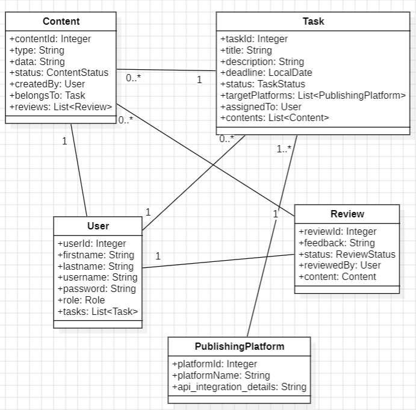
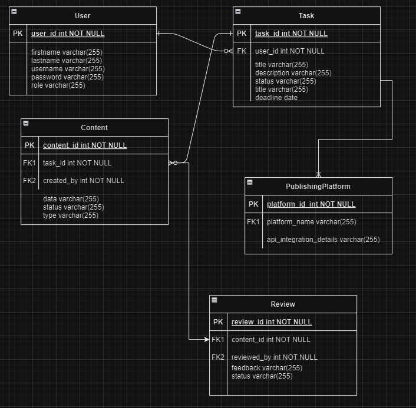
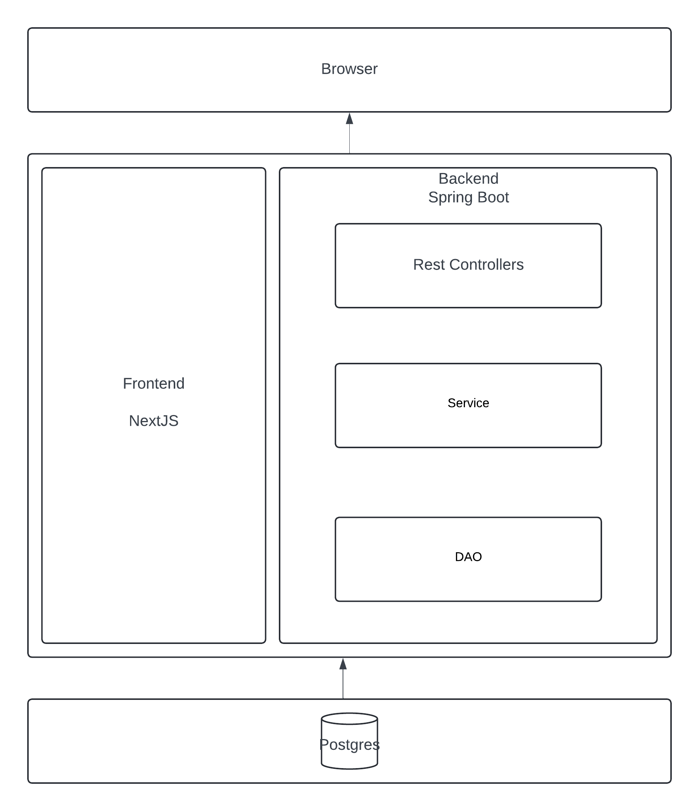

# Content Management System

## Problem Statement & Description
### Project Statement
The project aims to solve the problem of inefficient content creation, organization, 
collaboration, and publishing. Organizations and individuals often struggle due to the lack of a centralized 
platform, leading to scattered content, inconsistent formatting, and difficulties with collaboration. 
This results in delays, miscommunication, and poor content quality. This project proposes building a content management system (CMS) to address these issues.
### Description
The CMS will provide users with a single platform to efficiently create, organize, collaborate on, and publish digital content, like pictures, text, and videos. 

- The system will support multiple user roles: administrators, reviewers, and contributors.
    - Administrators can manage user roles, give out tasks, and publish content to various platforms (YouTube, TikTok, Instagram, Twitter).
    - Contributors can upload, organize, and create content, sending it to reviewers for approval.
    - Reviewers can provide feedback, make changes, and approve content for publication.

- Admins create tasks and assign a contributor to create the content. Contributors create the content and send them to reviewers to get reviewed. Reviewers will review the task and if the task is satisfactory they send it to admins to get published if not they send it back to the contributor with feedback. And the cycle continues like that.

### Functional Requirements Analysis

#### User Roles and Permissions
1. **Administrators**
    - **Task Management:** Create, assign, and oversee tasks for contributors.
    - **Publishing:** Publish approved content to various platforms.

2. **Contributors**
    - **Content Creation:** Create, and organize content based on assigned tasks.
    - **Task Management:** View assigned tasks, update task status, and submit content for review.
    - **Feedback Handling:** Receive and address feedback from reviewers, resubmit content if needed.

3. **Reviewers**
    - **Content Review:** Review content submitted by contributors, provide feedback, and make necessary changes.
    - **Approval Process:** Approve content for publication or send it back to contributors for revisions.

#### Functional Requirements
1. **User Management**
    - **Create/Manage Users:** Administrators can add new users, assign roles, and manage existing users.
    - **Role-Based Access Control:** Different user roles with specific permissions and capabilities.
2. **Task Management**
    - **Create Tasks:** Administrators can create tasks with detailed descriptions, deadlines, and target platforms.
    - **Assign Tasks:** Tasks can be assigned to contributors by administrators.
3. **Content Management**
    - **Create Content:** Contributors can create content based on the instructions in the task.
4. **Review and Feedback**
    - **Content Review:** Reviewers can access submitted content, provide feedback, and make edits.
    - **Approval/Rejection:** Reviewers can approve content for publication or reject it with feedback for revisions.
5. **Publishing**
    - **Publish Content:** Administrators can publish approved content to designated platforms.
    - **Platform Integration:** Integrate with YouTube, TikTok, Instagram, and Twitter for seamless content publishing.

### Diagrams

